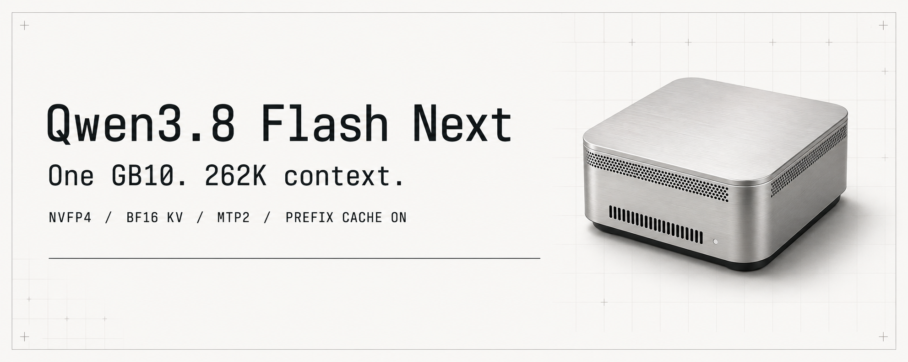
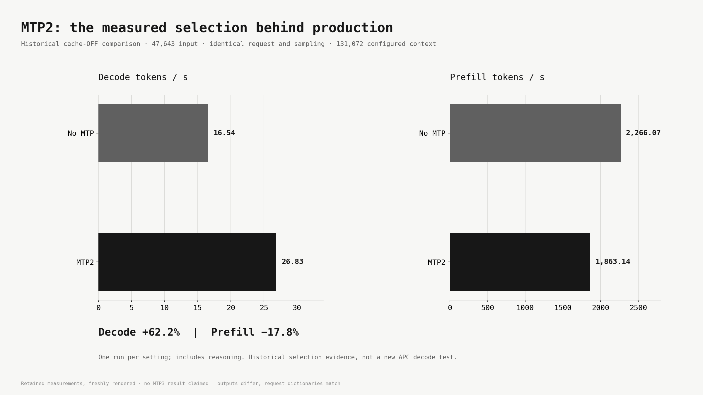
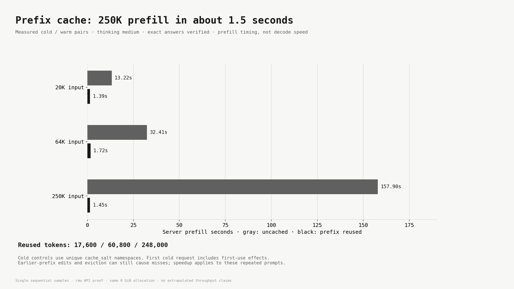
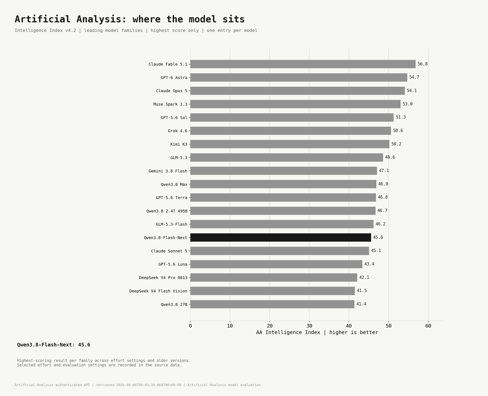

# Qwen3.8 Flash Next NVFP4 on one GB10



262K context, BF16 KV, MTP2, thinking enabled, and working prefix caching on one
DGX Spark class GB10 system. Original NVIDIA weights, with documented vLLM
patches. This is a tested local configuration, not an unmodified upstream recipe.

## Measured speeds

With MTP2, the 47,643-token matched test delivered **1,863 tok/s prefill** and
**26.83 tok/s decode**, a **62.2% decode increase** over no MTP. The separate
30K prompt test measured **2,051 tok/s prefill** and **33.84 tok/s decode**.

| MTP2 measurement | Input tokens | Prefill tok/s | Decode tok/s |
|---|---:|---:|---:|
| Matched MTP comparison | 47,643 | 1,863.14 | 26.83 |
| 30K prompt sweep | 29,985 | 2,050.96 | 33.84 |

These September 5 throughput tests used BF16 KV, thinking enabled and prefix
caching off, before the final 262K prefix-cache deployment. Each number is an
individual measured run. The [source data](reports/final/chart_data.json) and
[30K sweep chart](reports/final/09_30K_Decode_Historical.png) are included.



## Prefix-cache speeds

The 249,986-token repeated prompt reused 248,000 tokens. Server prefill fell
from **157.90 seconds to 1.45 seconds**. All five 250K retrieval variants passed.
That measures repeated prefill, not a 109x increase in generation speed.



## Start here

- [Setup and downloads](docs/SETUP.md)
- [Full final report](reports/final/Qwen38_Final_Production_Report.md)
- [PDF atlas](reports/final/Qwen38_Final_Production_Atlas.pdf)
- [Offline HTML report](reports/final/Qwen38_Final_Production_Offline.html)
- [Copyable examples](examples/README.md)
- [Complete source patch](patches/vllm-complete.patch)
- [Patch credits and source links](CREDITS.md)
- [Earlier charts from the same day](reports/earlier/README.txt)

The repository includes PNG charts, editable SVG masters, underlying JSON/CSV,
launch scripts, example requests and results, and an anonymized OpenCode config.
Model weights are downloaded from NVIDIA. They are not stored in this repo.

## Downloads

- [All charts, reports, scripts and examples](https://github.com/Radar105/qwen38-flash-next-nvfp4-spark/releases/download/v2026.09.05-apc.1/Qwen38_2026-09-05_All_Charts_and_Setup.zip)
- [Offline Git bundle](https://github.com/Radar105/qwen38-flash-next-nvfp4-spark/releases/download/v2026.09.05-apc.1/Qwen38_2026-09-05_Repository.bundle)
- [Release files](https://github.com/Radar105/qwen38-flash-next-nvfp4-spark/releases/tag/v2026.09.05-apc.1)

The ZIP contains the final and earlier chart sets in separate folders. The Git
bundle contains a clean source snapshot and can be cloned without a network connection:

```bash
git clone Qwen38_2026-09-05_Repository.bundle qwen38-flash-next-nvfp4-spark
```

## Configuration

| Setting | Value |
|---|---|
| Model | `nvidia/Qwen3.8-Flash-Next-NVFP4` |
| Model revision | `fab0aecb760cec45227f6656abcaafa11abca87a` |
| vLLM source base | `7fbd44cbe0a90b9c8fd3a94a0f0401ac4b1bc719` |
| Measured vLLM version | `0.28.1rc1.dev442+g7fbd44cbe.d20260905` |
| Context | 262144 total tokens |
| Output ceiling | 131072 tokens, bounded by remaining context |
| KV cache | 8 GiB BF16 |
| Speculation | Native MTP, 2 draft tokens |
| Execution | Eager, TP1, one sequence, batch2048 |
| Prefix cache | Enabled, Mamba align, retention interval1600 |
| Thinking | Medium default; low/xhigh available |
| PLE | Original FP8 table, local mmap reader |
| Vision | One image, max_pixels1048576; video disabled |

The checkpoint is mixed precision. Main routed experts are NVFP4; PLE and MTP
routed experts use their original FP8 formats; other layers include BF16.
The KV dtype is separate from weight quantization.

## What passed

- 21 raw prefix-cache requests, including 20K/64K/250K cold and warm retrieval,
  changed suffixes, shorter branches, interleaved requests, tools and follow-up.
- Separate raw and managed260,834-token three-needle retrieval.
- 11 managed cache requests, feature smoke tests, actual TUI warm action and
  an actual streaming OpenCode tool roundtrip with positive cache counters.
- 201 core/worker tests and186 cache/scheduler tests. Two PP2 cases require
  more than this single GPU. Source pre-commit passed.
- Complete patch applied to the pinned base in an isolated checkout. All23
  affected source/test files matched the qualified source by SHA-256.

Results are individual measured runs. No extended soak, concurrency above one,
MTP3 result, full131072-token generated answer, or bitwise hidden-state
equivalence is claimed. A fresh-machine build was not repeated for this release.

## Model context



Artificial Analysis lists Qwen3.8-Flash-Next at **45.6** on Intelligence Index
v4.2. The chart keeps one highest-scoring entry per model family across effort
settings and older versions, sorted by score. Distinct model roles remain
separate. Exact selected settings are recorded in the source data.

NVIDIA reports near-parity with FP8 across nine benchmarks. The largest decrease
is0.7 points. See the [official precision results](docs/NVIDIA_PRECISION.md).

## Credits and licenses

Qwen/Alibaba created the base model. NVIDIA produced the ModelOpt NVFP4 artifact.
vLLM, FlashInfer, PyTorch and their contributors provide the inference stack.
Individual patch authors are listed in [CREDITS.md](CREDITS.md). Charts come from measured data.

Code and vLLM-derived patches are provided under Apache-2.0. Model weights retain
the NVIDIA Open Model License and the base model's applicable terms. AA data
belongs to Artificial Analysis. This project does not claim endorsement by
those organizations.
