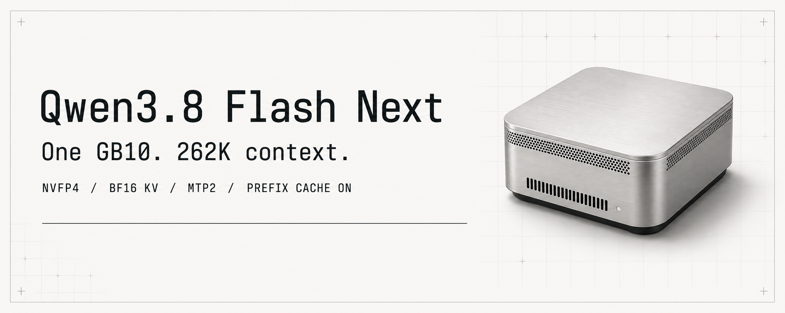
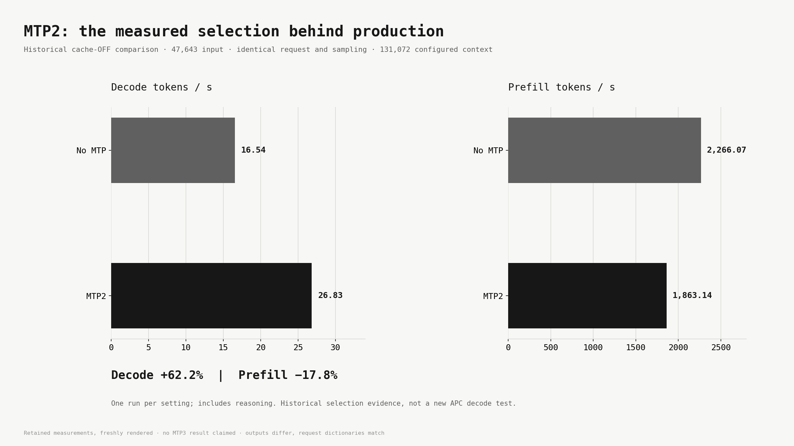
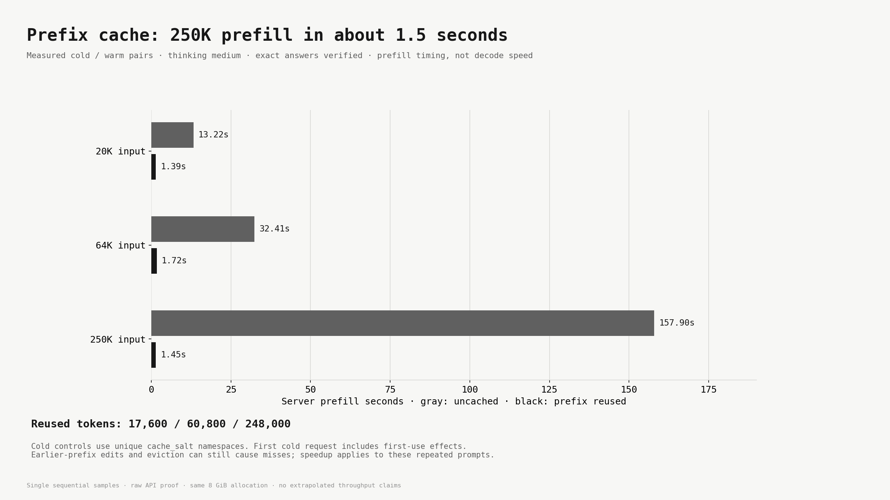
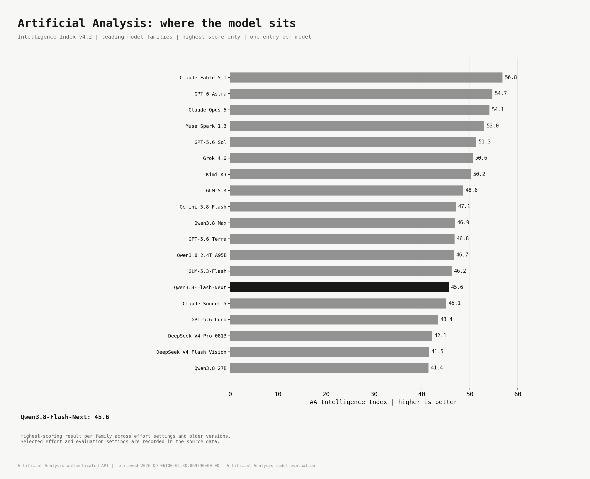

# Qwen3.8 Flash Next NVFP4 on one GB10



262K context, BF16 KV, MTP2, thinking enabled, and working prefix caching on one
DGX Spark class GB10 system. Original NVIDIA weights, with documented vLLM
patches. This is a tested local configuration, not an unmodified upstream recipe.

## Set up with your agent

Paste this repository link into your coding agent:

```text
https://github.com/Radar105/qwen38-flash-next-nvfp4-spark
```

Ask it to read `AGENTS.md` and `docs/SETUP.md`, inspect your DGX, and adapt the
setup to your machine. It should resolve your CUDA installation, Python
environment, model and cache paths, available memory, ports and existing
services before building or launching. Have it apply the documented patches,
download the pinned weights, then verify model responses and prefix-cache reuse.

## September 27 update

The recipe now tracks a new engine: vLLM base `e7900156` (September 27) plus
the complete patch, served with **MTP2** and the Marlin W4A16 MoE path.

- **Faster decode, same quality.** MTP2 beat MTP3 in every measured cell:
  **26.36 tok/s** sampled decode on a short prompt (MTP3 24.35) and
  **24.29 tok/s** at 30K (MTP3 22.43), greedy **28.53 / 28.25 tok/s**, prefill
  **2,053 to 2,069 tok/s** at 30K. GSM8K (100 questions, greedy) and prompt NLL
  (4K to 131K) match the previous build.
- **Correctness fixes for hybrid MTP with prefix caching**, now in the base:
  [#58434](https://github.com/vllm-project/vllm/pull/58434) (padded prompt
  tails over cached state are verified as speculative rows instead of being
  written into the linear-attention state) and
  [#58368](https://github.com/vllm-project/vllm/pull/58368) (prompt-tail
  prefix-cache hits restored under MTP).
- **Added to the patch:** deterministic sparse top-k
  ([#55122](https://github.com/vllm-project/vllm/pull/55122)), bounded
  accepted-token state lookups in GDN speculative decoding
  ([#50021](https://github.com/vllm-project/vllm/pull/50021)), drafting within
  each request's top-k/top-p ([#56724](https://github.com/vllm-project/vllm/pull/56724)),
  and the GDN gate projection matmul
  ([#57318](https://github.com/vllm-project/vllm/pull/57318),
  `VLLM_GDN_BA_GEMV_MAX_TOKENS=8`).
- **Marlin W4A16** (`--moe-backend marlin`): the NVFP4 expert weights are
  unchanged, activations stay BF16 instead of being quantized to FP4. Same
  checkpoint, equal or better speed, lower run-to-run logprob variation.
- `--engram-config '{"cpu_offload":false}'` replaces the removed
  `VLLM_PLE_CPU_OFFLOAD` setting; batch 4096.
- 20K and 250K cold/warm retrieval pass on the live engine; 250K warm prefill
  **1.31 s** with 248,000 tokens reused.

Method, raw results and one known limit (prefill is not bit-reproducible):
[September 27 measurements](reports/2026-09-27/README.md). Earlier release
notes are in the [baseline record](docs/BASELINE.md).

The baseline keeps native 4096×4096 image processing, multi-image history,
xhigh thinking by default, reasoning retention, and a 4 GiB shared-memory
image cache.

After your agent checks the host, one entry point builds, downloads or reuses
verified weights, starts the engine, and checks correct cold/warm retrieval:

```bash
bash scripts/rebuild.sh
```

Use `bash scripts/rebuild.sh --check` for read-only prerequisites and recipe
integrity. A fresh-machine rebuild was not run for this update. The complete
patch was applied to a fresh checkout of the base and matched the live source
by SHA-256, and the launch script matched the live process flag by flag.

## vLLM configuration reference

The script below shows the tested settings and the repository's example
installation layout. Its paths must be checked and fitted to your system by
you or your agent before use. The full setup workflow is in [docs/SETUP.md](docs/SETUP.md).

```bash
#!/usr/bin/env bash
set -euo pipefail
setup_root="${QWEN_SETUP_ROOT:-$HOME/qwen38-spark}"
mkdir -p "$setup_root/cache" "$setup_root/xdg-cache" "$setup_root/hf-cache" "$setup_root/tmp"
export HF_HOME="$setup_root/hf-cache" TMPDIR="$setup_root/tmp"
export CUDA_HOME="${CUDA_HOME:-/usr/local/cuda}"
export PATH="$setup_root/venv/bin:$CUDA_HOME/bin:$PATH"
export MAX_JOBS=1
export NVCC_THREADS=1
export VLLM_PLE_MMAP=1
export VLLM_USE_V2_MODEL_RUNNER=1
export VLLM_USE_BREAKABLE_CUDAGRAPH=1
export VLLM_ALLOW_LONG_MAX_MODEL_LEN=1
export VLLM_SPARSE_INDEXER_MAX_LOGITS_MB=64
export VLLM_GDN_BA_GEMV_MAX_TOKENS=8
export VLLM_CACHE_ROOT="$setup_root/cache"
export XDG_CACHE_HOME="$setup_root/xdg-cache"
export HF_HUB_OFFLINE=1
export TOKENIZERS_PARALLELISM=false
cd "$setup_root/src/vllm"
exec "$setup_root/venv"/bin/vllm serve \
  "${QWEN_MODEL_DIR:-$setup_root/models/nvidia-Qwen3.8-Flash-Next-NVFP4}" \
  --served-model-name nvidia/Qwen3.8-Flash-Next-NVFP4 \
  --host "${QWEN_HOST:-127.0.0.1}" --port "${QWEN_PORT:-8092}" \
  --tensor-parallel-size 1 --dtype bfloat16 --quantization modelopt \
  --max-model-len 262144 --max-num-seqs 1 --max-num-batched-tokens 4096 \
  --compilation-config '{"mode":0,"cudagraph_mode":"FULL_AND_PIECEWISE"}' \
  --kv-cache-dtype auto --kv-cache-memory-bytes 8G \
  --moe-backend marlin --engram-config '{"cpu_offload":false}' \
  --gpu-memory-utilization 0.8 --enable-prefix-caching --mamba-cache-mode align --prefix-cache-retention-interval 1600 \
  --load-format safetensors --safetensors-load-strategy lazy \
  --model-loader-extra-config '{"enable_multithread_load":true,"num_threads":4}' \
  --limit-mm-per-prompt '{}' \
  --enable-auto-tool-choice --tool-call-parser qwen3_coder --reasoning-parser qwen3 \
  --skip-mm-profiling --mm-processor-cache-type shm \
  --mm-processor-cache-gb 4 --mm-shm-cache-max-object-size-mb 512 \
  --generation-config auto --override-generation-config '{"max_new_tokens":131072}' \
  --speculative-config '{"method":"mtp","num_speculative_tokens":2}' \
  --default-chat-template-kwargs '{"enable_thinking":true,"preserve_thinking":true,"reasoning_effort":"xhigh"}'
```

The launch uses 262144 context, MTP2, BF16 KV 8 GiB, Marlin W4A16 experts,
batch 4096 and prefix caching with align/retention 1600. The model-card output ceiling is 131072 tokens, bounded
by remaining context.

## Three hours of sustained use

On September 6 the operator reported three hours of continuous agentic OpenCode work, including
visual tasks and long conversations across multiple compactions. Across 392
active decode log windows in that period, median generation was **22.7 tok/s**,
reaching **35.1 tok/s**. The latest reported prefix-cache hit rate was **94.7%**
and image-cache hit rate **97.5%**. These are production log-window measurements
and cumulative cache rates, not isolated per-request benchmarks.
[Anonymous measurements](baseline/operational-speed.json).

## Measured speeds

September 27, this release, one sequence, 1024 generated tokens, thinking off,
mean of two runs. Sampled uses the model card's sampling (temperature 1.0,
top_p 0.95, top_k 20).

| Decode tok/s | MTP3 | **MTP2 (published)** |
|---|---:|---:|
| Short prompt, sampled | 24.35 | **26.36** |
| Short prompt, greedy | 27.49 | **28.53** |
| 30,021-token prompt, sampled | 22.43 | **24.29** |
| 30,021-token prompt, greedy | 27.45 | **28.25** |
| 30,021-token prefill tok/s | 2,038 to 2,048 | **2,053 to 2,069** |

MTP2 mean acceptance length is 2.05 to 2.16 greedy and 1.77 to 1.98 sampled.
[Method and raw results](reports/2026-09-27/README.md).

Historical, September 5 (thinking enabled, shorter outputs, reasoning tokens
included, eager execution): MTP2 decoded **26.83 tok/s** on a 47,643-token
matched test, **62.2%** above no MTP, and **33.84 tok/s** on a 30K prompt with
**2,051 tok/s** prefill. Those runs are not directly comparable with the table
above. The [source data](reports/final/chart_data.json) and
[30K sweep chart](reports/final/09_30K_Decode_Historical.png) are included.



## Prefix-cache speeds

September 27, this release: the 249,971-token repeated prompt reused 248,000
tokens and server prefill fell from **129.61 seconds to 1.31 seconds**, both
answers correct. At 19,969 tokens: **10.13 s to 1.27 s**. That measures
repeated prefill, not faster generation.

September 5 (chart below): 249,986 tokens, **157.90 s to 1.45 s**, all five
250K retrieval variants passed.



## Start here

- [Prepare a clean headless DGX](docs/HEADLESS.md)
- [Setup and downloads](docs/SETUP.md)
- [Full final report](reports/final/Qwen38_Final_Production_Report.md)
- [PDF atlas](reports/final/Qwen38_Final_Production_Atlas.pdf)
- [Offline HTML report](reports/final/Qwen38_Final_Production_Offline.html)
- [Copyable examples](examples/README.md)
- [Complete source patch](patches/vllm-complete.patch)
- [Patch credits and source links](CREDITS.md)
- [Earlier charts from the same day](reports/earlier/README.txt)

The repository includes PNG charts, editable SVG masters, underlying JSON/CSV,
launch scripts, example requests and results, and an anonymized OpenCode config.
Model weights are downloaded from NVIDIA. They are not stored in this repo.

## Downloads

- [All charts, reports, scripts and examples](https://github.com/Radar105/qwen38-flash-next-nvfp4-spark/releases/download/v2026.09.06-baseline/Qwen38_2026-09-06_Baseline.zip)
- [Offline Git bundle](https://github.com/Radar105/qwen38-flash-next-nvfp4-spark/releases/download/v2026.09.06-baseline/Qwen38_2026-09-06_Repository.bundle)
- [Release files](https://github.com/Radar105/qwen38-flash-next-nvfp4-spark/releases/tag/v2026.09.06-baseline)

These September 6 release assets predate the September 15 and September 27
updates; `main` is current. The ZIP contains the final and earlier chart sets in separate folders. The Git
bundle contains a clean source snapshot and can be cloned without a network connection:

```bash
git clone Qwen38_2026-09-06_Repository.bundle qwen38-flash-next-nvfp4-spark
```

## Configuration

| Setting | Value |
|---|---|
| Model | `nvidia/Qwen3.8-Flash-Next-NVFP4` |
| Model revision | `fab0aecb760cec45227f6656abcaafa11abca87a` |
| vLLM source base | `e7900156e130c9880eb03b7c1f2df32820e7a2be` |
| Measured vLLM version | `0.30.1rc1.dev232+g4e56a7287` |
| Context | 262144 total tokens |
| Output ceiling | 131072 tokens, bounded by remaining context |
| KV cache | 8 GiB BF16 |
| MoE experts | Marlin W4A16: NVFP4 weights, BF16 activations |
| Speculation | Native MTP, 2 draft tokens |
| Execution | CUDA graphs FULL_AND_PIECEWISE, Model Runner V2, TP1, one sequence, batch 4096 |
| QSA indexer | `VLLM_SPARSE_INDEXER_MAX_LOGITS_MB=64` |
| Prefix cache | Enabled, Mamba align, retention interval1600 |
| Thinking | xhigh default, enabled, reasoning retained; low/medium available |
| PLE | Original FP8 table, local mmap reader, `--engram-config '{"cpu_offload":false}'` |
| Vision | Native processor limits, 4096×4096 tested, multi-image history |
| Image cache | Shared memory 4 GiB, maximum object 512 MiB |

The checkpoint is mixed precision. Main routed experts are NVFP4; PLE and MTP
routed experts use their original FP8 formats; other layers include BF16.
The KV dtype is separate from weight quantization.

## What passed

- Operator-confirmed sustained agentic OpenCode use, including long
  conversations across multiple compactions and visual workflows.

- September 6: native 4096×4096 input with 16384 image tokens; PNG/JPEG/WebP,
  four-image API history, five-image OpenCode history, image tools, xhigh and
  retained reasoning. [Details and limits](docs/VISION_REASONING.md).

- 21 raw prefix-cache requests, including 20K/64K/250K cold and warm retrieval,
  changed suffixes, shorter branches, interleaved requests, tools and follow-up.
- Separate raw and managed260,834-token three-needle retrieval.
- 11 managed cache requests, feature smoke tests, actual TUI warm action and
  an actual streaming OpenCode tool roundtrip with positive cache counters.
- 201 core/worker tests and186 cache/scheduler tests. Two PP2 cases require
  more than this single GPU. Source pre-commit passed.
- September 27: complete patch applied to a fresh checkout of the pinned base;
  all 52 patched source/test files matched the live source by SHA-256; the
  portable launch script matched the live process on all 33 flags and its
  environment; the 205-package lock matched the live environment exactly and
  passed a hash-checked install dry-run; deterministic top-k kernel tests
  (223) passed on GB10; 20K and 250K cold/warm retrieval passed; GSM8K and
  prompt NLL matched the previous build.
- September 15: complete patch applied to a fresh checkout of the pinned base.
  All 32 affected source/test files matched the live source by SHA-256; the
  portable launch script matched the live process flag by flag; the lock
  passed a hash-checked install dry-run.
- September 14, live engine: 204 parser tests, streaming and non-streaming
  parser regression with literal tool markers, 120K retrieval (63.6 s) and
  250K cold retrieval (128.8 s, 0.22 GiB memory drop, 7.3 s warm repeat),
  OpenCode tool round trip with prefix hits.

Results are individual measured runs. No extended soak, concurrency above one,
full 131072-token generated answer, or bitwise reproducibility is claimed:
repeated identical prefills differ on a few tokens (see the
[September 27 limits](reports/2026-09-27/README.md#known-limit-prefill-is-not-bit-reproducible)).
A fresh-machine build was not repeated for this release. Vision tests date
from September 6.

## Model context



Artificial Analysis lists Qwen3.8-Flash-Next at **45.6** on Intelligence Index
v4.2. The chart keeps one highest-scoring entry per model family across effort
settings and older versions, sorted by score. Distinct model roles remain
separate. Exact selected settings are recorded in the source data.

NVIDIA reports near-parity with FP8 across nine benchmarks. The largest decrease
is0.7 points. See the [official precision results](docs/NVIDIA_PRECISION.md).

## Credits and licenses

Qwen/Alibaba created the base model. NVIDIA produced the ModelOpt NVFP4 artifact.
vLLM, FlashInfer, PyTorch and their contributors provide the inference stack.
Individual patch authors are listed in [CREDITS.md](CREDITS.md). Charts come from measured data.

Code and vLLM-derived patches are provided under Apache-2.0. Model weights retain
the NVIDIA Open Model License and the base model's applicable terms. AA data
belongs to Artificial Analysis. This project does not claim endorsement by
those organizations.
