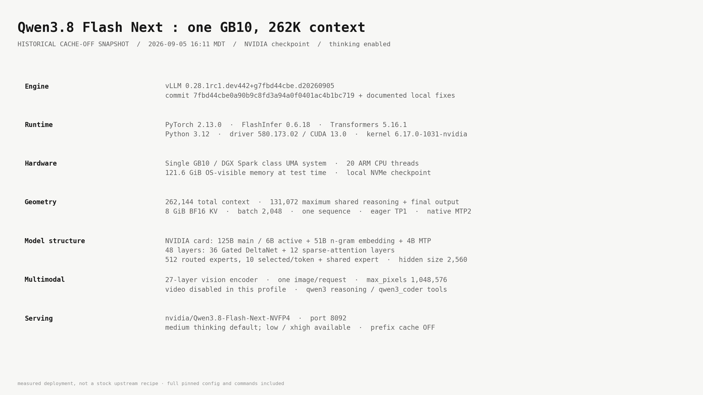
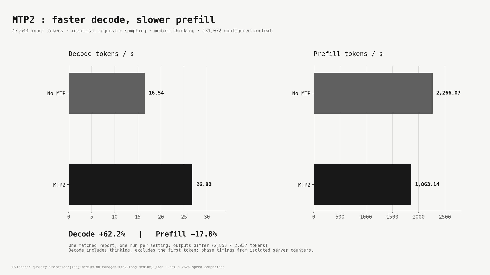
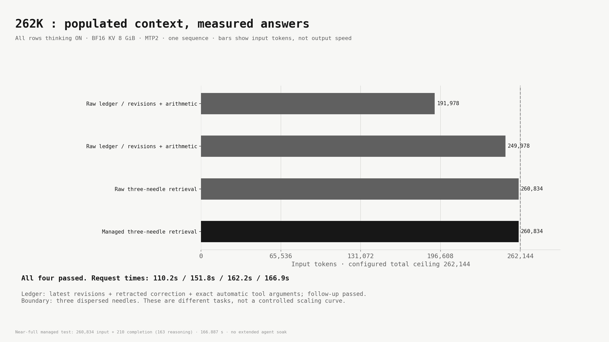
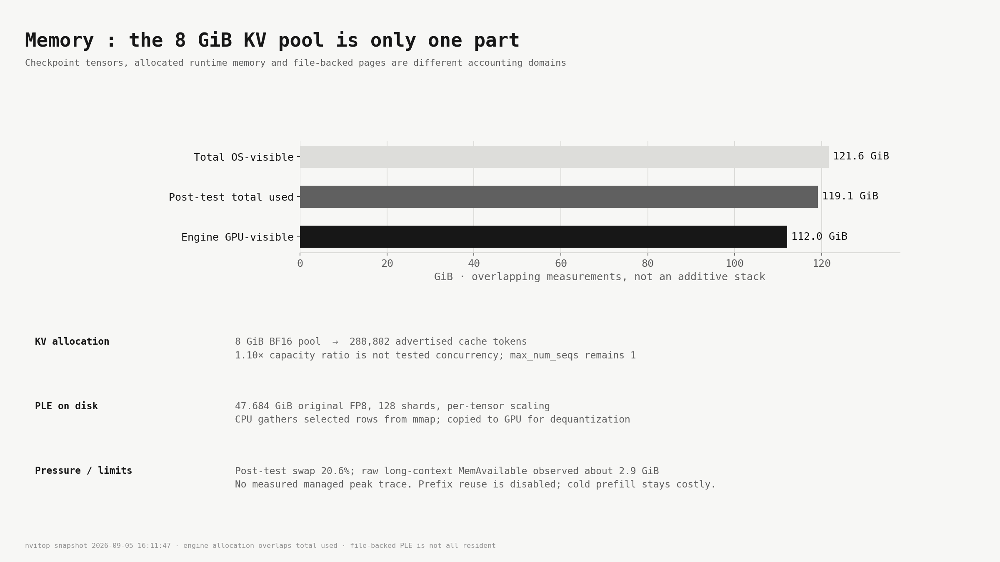
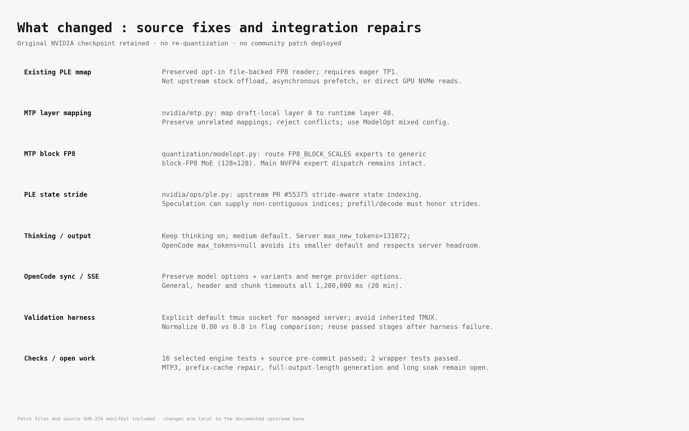
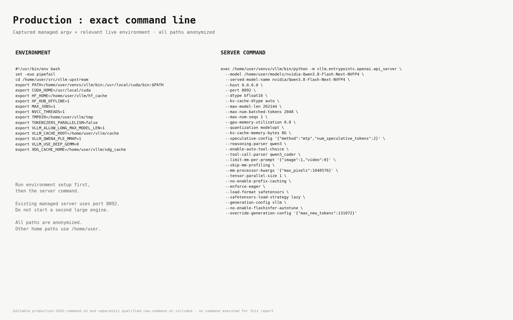
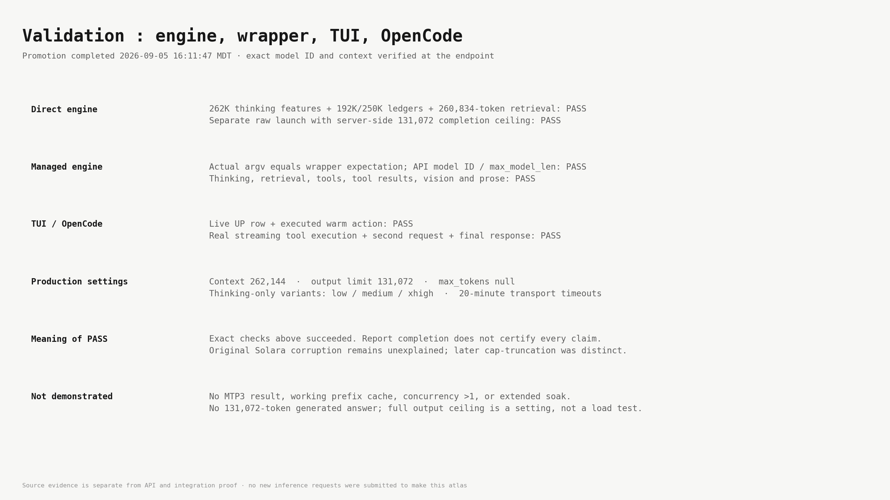

# Historical cache-OFF: NVIDIA Qwen3.8 Flash Next NVFP4 : 262K deployment dossier

DGX Spark · 2026-09-05. Production proof at16:11:47 MDT.

## Visual atlas

Seven figures follow the recovered August31 FrankenGPT off-white/monospace style. The specific 4:24 a.m. download could not be matched by phone metadata at generation time. Figures and data are regenerated by `build_report.py`; measurements come from retained tests, with no new inference load.

### 01 Runtime and Model



measured deployment, not a stock upstream recipe · full pinned config and commands included

### 02 MTP2 Performance



Evidence: quality-iteration/{long-medium-8k,managed-mtp2-long-medium}.json · not a 262K speed comparison

### 03 Context Qualification



Near-full managed test: 260,834 input + 210 completion (163 reasoning) · 166.887 s · no extended agent soak

### 04 Memory and PLE



nvitop snapshot 2026-09-05 16:11:47 · engine allocation overlaps total used · file-backed PLE is not all resident

### 05 Fixes and Limits



Patch files and source SHA-256 manifest included · changes are local to the documented upstream base

### 06 Production Command



Editable production-262k-command.sh and separately qualified-raw-command.sh included · no command executed for this report

### 07 Validation and Production



Source evidence is separate from API and integration proof · no new inference requests were submitted to make this atlas

## Runtime versions and exact fixes (text reference)

| Component | Version / identity |
|---|---|
| vLLM | `0.28.1rc1.dev442+g7fbd44cbe.d20260905` |
| Upstream base | `7fbd44cbe0a90b9c8fd3a94a0f0401ac4b1bc719` plus preserved local patches |
| PyTorch | `2.13.0` |
| FlashInfer | `0.6.18` |
| Transformers | `5.16.1` |
| Interpreter / platform | Python3.12 venv, Linux aarch64 |
| Driver / reported CUDA | `580.173.02` / `13.0` (nvitop snapshot) |
| Kernel | `6.17.0-1031-nvidia` |
| Target expert backend | `FLASHINFER_CUTLASS` NVFP4 |
| Draft expert backend | Generic block-FP8 MoE / Triton, blocks128×128 |

1. Preserved existing `VLLM_QWEN4_PLE_MMAP=1` implementation. The original FP8 table remains file-backed; selected CPU-gathered rows are copied to GPU for upstream dequantization. Eager execution and TP1 guards remain. It is not asynchronous prefetch or direct GPU NVMe access.
2. `vllm/models/qwen4_exp/nvidia/mtp.py`: remap ModelOpt draft-local layer0 to runtime global layer48 using the actual draft start/count. Preserve unrelated mappings, make repeat application safe, reject conflicting entries. Construct the draft with the properly remapped mixed-precision quantization config.
3. `vllm/model_executor/layers/quantization/modelopt.py`: dispatch `FP8_BLOCK_SCALES` routed experts through generic `Fp8MoEMethod` with the checkpoint block geometry. Preserve the main NVFP4 path. This makes the original mixed-precision draft load correctly; it does not convert all MTP weights to FP8.
4. `vllm/models/qwen4_exp/nvidia/ops/ple.py`: official upstream PR55375 state-index stride handling. Strided/noncontiguous prefill and decode indices must be indexed using their actual layout during speculation. Focused tests cover the affected GPU convolution path.
5. `vllm_cli.py`: preserve existing model request options, reasoning variants and unrelated models when syncing provider metadata. Merge provider options so header/chunk timeouts survive. Smoke checks reject reasoning-only or length-truncated output as success. Two regression tests passed.
6. Output/SSE integration: thinking remains enabled; default medium, supported low/xhigh variants. Model metadata output131072, request `max_tokens:null`, engine override `max_new_tokens:131072`. General/header/chunk timeouts1200000ms. This avoids the demonstrated8192-token malformed tool-write truncation and the client's smaller default ceiling; it does not establish the cause of the original damaged report.
7. Promotion harness: explicitly select the managed server's default tmux socket and remove inherited TMUX on CLI launch. Normalize numeric flag comparison (`0.80` versus `0.8`). A harness failure was resumed from the passed raw output-cap proof without repeating that expensive load.

Sixteen selected engine regression tests and source pre-commit checks passed. No checkpoint re-quantization or new full rebuild was required for the Python fixes. Keep MAX_JOBS=1, NVCC_THREADS=1, cached FlashInfer kernels, DEEP_GEMM disabled and FlashInfer autotuning disabled for this measured configuration. The missing GB10 draft MoE tuning JSON remains an optimization candidate, not a fix applied here.

The performance comparison is16.5368→26.8284 decode tokens/s (+62.2%) and2266.074→1863.142 prefill tokens/s (−17.8%), from identical47643-token requests at131072 configured context. These figures include reasoning tokens and are not measured262K decode rates.

## Full runtime command

```bash
#!/usr/bin/env bash
set -euo pipefail
# Production-equivalent command. Stop the existing large engine before launching.
cd /home/user/src/vllm-upstream
export PATH=/home/user/venvs/vllm/bin:/usr/local/cuda/bin:$PATH
export CUDA_HOME=/usr/local/cuda
export HF_HOME=/home/user/vllm/hf_cache
export HF_HUB_OFFLINE=1
export MAX_JOBS=1
export NVCC_THREADS=1
export TMPDIR=/home/user/vllm/tmp
export TOKENIZERS_PARALLELISM=false
export VLLM_ALLOW_LONG_MAX_MODEL_LEN=1
export VLLM_CACHE_ROOT=/home/user/vllm/cache
export VLLM_QWEN4_PLE_MMAP=1
export VLLM_USE_DEEP_GEMM=0
export XDG_CACHE_HOME=/home/user/vllm/xdg_cache
exec /home/user/venvs/vllm/bin/python -m vllm.entrypoints.openai.api_server \
  --model /home/user/models/nvidia-Qwen3.8-Flash-Next-NVFP4 \
  --served-model-name nvidia/Qwen3.8-Flash-Next-NVFP4 \
  --host 0.0.0.0 \
  --port 8092 \
  --dtype bfloat16 \
  --kv-cache-dtype auto \
  --max-model-len 262144 \
  --max-num-batched-tokens 2048 \
  --max-num-seqs 1 \
  --gpu-memory-utilization 0.8 \
  --quantization modelopt \
  --kv-cache-memory-bytes 8G \
  --speculative-config '{"method":"mtp","num_speculative_tokens":2}' \
  --reasoning-parser qwen3 \
  --enable-auto-tool-choice \
  --tool-call-parser qwen3_coder \
  --limit-mm-per-prompt '{"image":1,"video":0}' \
  --skip-mm-profiling \
  --mm-processor-kwargs '{"max_pixels":1048576}' \
  --tensor-parallel-size 1 \
  --no-enable-prefix-caching \
  --enforce-eager \
  --load-format safetensors \
  --safetensors-load-strategy lazy \
  --generation-config vllm \
  --no-enable-flashinfer-autotune \
  --override-generation-config '{"max_new_tokens":131072}'
```

## Managed operations

```bash
vllm-cli status
vllm-cli start nvidia-qwen3.8-flash-next-nvfp4 --dry-run --keep-others
curl -fsS http://127.0.0.1:8092/health
curl -fsS http://127.0.0.1:8092/v1/models
nvitop --once --no-unicode
```

The dry run does not start another model. For an intentional future restart, use the wrapper stop/start lifecycle; do not execute the supplied direct launch alongside the existing server.

## Exact managed profile

```json
{
  "display_name": "NVIDIA Qwen3.8 Flash Next NVFP4 | 262K | MTP2 | BF16 KV",
  "description": "NVIDIA mixed NVFP4 checkpoint on production native vLLM; original FP8 PLE rows mapped from disk, eager TP1; startup MM profiling skipped and images capped at 1,048,576 pixels.",
  "target_basename": "nvidia-Qwen3.8-Flash-Next-NVFP4",
  "target_repo": "nvidia/Qwen3.8-Flash-Next-NVFP4",
  "served_model_name": "nvidia/Qwen3.8-Flash-Next-NVFP4",
  "provider_name": "qwen38-flash-next-nvfp4-vllm-local",
  "provider_label": "NVIDIA Qwen3.8 Flash Next NVFP4 | 262K | MTP2 | BF16 KV",
  "provider_display_name": "NVIDIA Qwen3.8 Flash Next NVFP4",
  "backend": "native",
  "port": 8092,
  "max_model_len": 262144,
  "max_num_batched_tokens": 2048,
  "max_num_seqs": 1,
  "gpu_memory_utilization": 0.8,
  "kv_cache_memory_bytes": "8G",
  "dtype": "bfloat16",
  "kv_cache_dtype": "auto",
  "quantization": "modelopt",
  "output_limit": 131072,
  "reasoning_budget": 4096,
  "startup_timeout": 1800,
  "trust_remote_code": false,
  "reasoning_parser": "qwen3",
  "tool_call_parser": "qwen3_coder",
  "limit_mm_per_prompt": "{\"image\":1,\"video\":0}",
  "enable_prefix_caching": false,
  "enable_auto_tool_choice": true,
  "extra_env": {
    "VLLM_QWEN4_PLE_MMAP": "1",
    "CUDA_HOME": "/usr/local/cuda",
    "MAX_JOBS": "1",
    "NVCC_THREADS": "1",
    "HF_HUB_OFFLINE": "1",
    "TOKENIZERS_PARALLELISM": "false",
    "VLLM_USE_DEEP_GEMM": "0"
  },
  "extra_args": [
    "--skip-mm-profiling",
    "--mm-processor-kwargs",
    "{\"max_pixels\":1048576}",
    "--tensor-parallel-size",
    "1",
    "--no-enable-prefix-caching",
    "--enforce-eager",
    "--load-format",
    "safetensors",
    "--safetensors-load-strategy",
    "lazy",
    "--generation-config",
    "vllm",
    "--no-enable-flashinfer-autotune",
    "--override-generation-config",
    "{\"max_new_tokens\":131072}"
  ],
  "reasoning": true,
  "vision": true,
  "tool_call": true,
  "opencode_enabled": true,
  "speculative_config": "{\"method\":\"mtp\",\"num_speculative_tokens\":2}"
}
```

## OpenCode provider

```json
{
  "npm": "@ai-sdk/openai-compatible",
  "name": "NVIDIA Qwen3.8 Flash Next NVFP4",
  "options": {
    "baseURL": "http://127.0.0.1:8092/v1",
    "maxRetries": 3,
    "timeout": 1200000,
    "chunkTimeout": 1200000,
    "headerTimeout": 1200000
  },
  "models": {
    "nvidia/Qwen3.8-Flash-Next-NVFP4": {
      "name": "NVIDIA Qwen3.8 Flash Next NVFP4 | 262K | MTP2 | BF16 KV",
      "reasoning": true,
      "tool_call": true,
      "limit": {
        "context": 262144,
        "output": 131072
      },
      "reasoning_budget": 4096,
      "vision": true,
      "modalities": {
        "input": [
          "text",
          "image"
        ],
        "output": [
          "text"
        ]
      },
      "options": {
        "temperature": 1.0,
        "top_p": 0.95,
        "top_k": 20,
        "presence_penalty": 0,
        "repetition_penalty": 1.0,
        "reasoningEffort": "medium",
        "chat_template_kwargs": {
          "enable_thinking": true
        },
        "max_tokens": null
      },
      "variants": {
        "low": {
          "reasoningEffort": "low",
          "chat_template_kwargs": {
            "enable_thinking": true
          }
        },
        "medium": {
          "reasoningEffort": "medium",
          "chat_template_kwargs": {
            "enable_thinking": true
          }
        },
        "xhigh": {
          "reasoningEffort": "xhigh",
          "chat_template_kwargs": {
            "enable_thinking": true
          }
        },
        "high": {
          "disabled": true
        },
        "none": {
          "disabled": true
        }
      }
    }
  }
}
```

## Model and artifact specifications

- Checkpoint: `nvidia/Qwen3.8-Flash-Next-NVFP4`
- Pinned revision: `fab0aecb760cec45227f6656abcaafa11abca87a`; 11 safetensors; original weights retained.
- Main routed experts: NVFP4 (group size16); remaining main layers BF16.
- MTP routed experts: block-scaled FP8 (128×128); other MTP layers BF16.
- PLE: FP8 per-tensor scale, 51,200,245,760 bytes, 128 × 2,500,012 ×160.
- Text:48 layers, hidden2560, vocab248320, attention heads24/KV heads2, head dimension256; 36 linear +12 sparse attention layers;512 experts,10 selected plus shared; intermediate640.
- MTP: one auxiliary layer reused for two speculative tokens.
- Vision:27 layers, hidden1152,16 heads, patch16, merge2; profile permits1 image and0 videos.
- Native local config max_position_embeddings262144. Full model config attached. NVIDIA card specifies125B main /6B activated, plus51B n-gram embeddings and4B MTP; preserve those categories rather than calling every component125B total.

## Tests, fixes and evidence limits

## Production262K completed : September5 16:11:47

OpenCode now names the model **NVIDIA Qwen3.8 Flash Next NVFP4 | 262K | MTP2 | BF16 KV**.
The live endpoint `http://127.0.0.1:8092/v1` serves
`nvidia/Qwen3.8-Flash-Next-NVFP4` with262144 context tokens. Live and mirrored
vLLM profile/OpenCode provider configurations match. Restart an already-open
OpenCode instance to refresh its cached catalog.

The production geometry is8GiB BF16 KV, MTP2, batch2048, one sequence, eagerTP1,
original FP8 PLE mmap, thinking enabled (medium default; low/xhigh available),
and prefix caching disabled. The engine caps shared reasoning+final completion
at131072 tokens, further limited by remaining context. OpenCode sends
`max_tokens:null`; this bypasses its32000 default without permitting the server
to exceed the configured ceiling. General, header and chunk timeouts are20min.

Evidence:
- `production-262k-runtime.json` and `production-262k-parity.json`: actual managed
  argv equals wrapper expectation, semantically matches the separately proven
  direct launch. API PID2631967, EngineCore2632075 at promotion time.
- `production-262k-models.json`: exact served model and262144 ceiling.
- `production-262k-smoke.json`: thinking, retrieval, tools, tool results, vision,
  and prose passed. Prose889 completion tokens in38.74s,22.95 end-to-end tok/s;
  this is a workload measurement, not a broad benchmark.
- `production-262k-thinking-boundary.json`:260834 input +210 completion tokens
  (163 reasoning), correct three-needle retrieval in166.887s.
- `production-262k-tui.json`: live UP row and executed warm action passed.
  Its256K binary-unit display represents262144 tokens, matching the262K label.
- `production-262k-opencode/result.json`: real streaming two-request OpenCode
  tool execution and final response passed; medium thinking and null output
  budget confirmed on the wire.
- `production-262k-timeout-preservation.json`: long-prefill transport settings
  retained before the OpenCode round trip. The CLI nested-option merge fix
  passed both tests in `test_provider_sync.py`.

Memory remains tight: cache capacity288802 tokens; post-check nvitop119.1GiB
of121.6GiB total, engine112.0GiB GPU-visible, swap20.6%. This is a tested single
sequence deployment;1.10x allocator capacity is not tested concurrency. The
near-full managed proof is retrieval, while the separate raw192K/250K ledgers
exercise revision arithmetic and automatic tools. No long production soak or
131072-token output generation was run. Cold long prefill remains expensive.
MTP3 and prefix caching remain untested here; no community patch was deployed.
The prior131K artifacts remain the rollback evidence.


The source fixes are detailed in figure05 and preserved in `evidence/` with file hashes and regression logs. The existing PLE mmap implementation is a local customization. The MTP ModelOpt mapping and FP8 dispatch are local repairs; PLE stride handling is attributed to official upstream [PR55375](https://github.com/vllm-project/vllm/pull/55375). No community implementation was deployed.

### Methodology

The performance graph compares identical request dictionaries, including prompt and sampling, at131072 configured context. Server-counter isolation was recorded. Decode excludes the first output token and includes reasoning tokens. One run per setting, no confidence interval or broad quality score. Long-context rows use different tasks and report whole-request time, not phase-specific prefill throughput. Memory figures overlap and must not be summed. The20-minute timeouts were preserved and exercised by a short real OpenCode round trip; a20-minute stream was not tested.

### Official provenance

- [NVIDIA pinned model](https://huggingface.co/nvidia/Qwen3.8-Flash-Next-NVFP4/tree/fab0aecb760cec45227f6656abcaafa11abca87a)
- [vLLM upstream base](https://github.com/vllm-project/vllm/tree/7fbd44cbe0a90b9c8fd3a94a0f0401ac4b1bc719)
- [NVIDIA Model Optimizer](https://github.com/NVIDIA/Model-Optimizer)

Facts in this dossier are derived from the pinned local model config/card, saved runtime evidence and verified source. Links identify provenance; no fresh external benchmark claims are added.

## Anonymization

Model and report paths use `/home/user`; the endpoint uses `127.0.0.1`. All home paths, personal names, hostnames and private network addresses are generalized in this publication copy. Adapt paths when using another installation.
