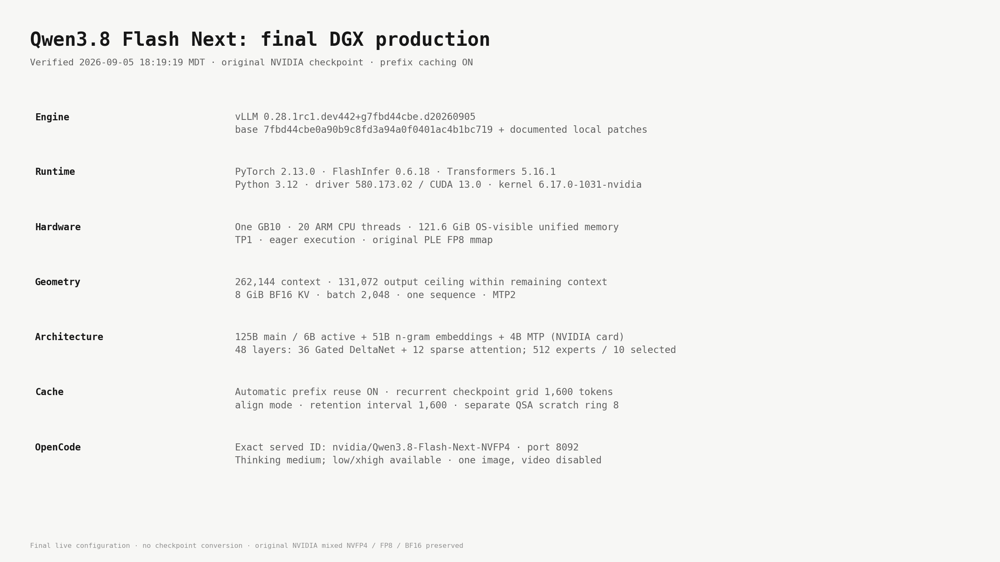
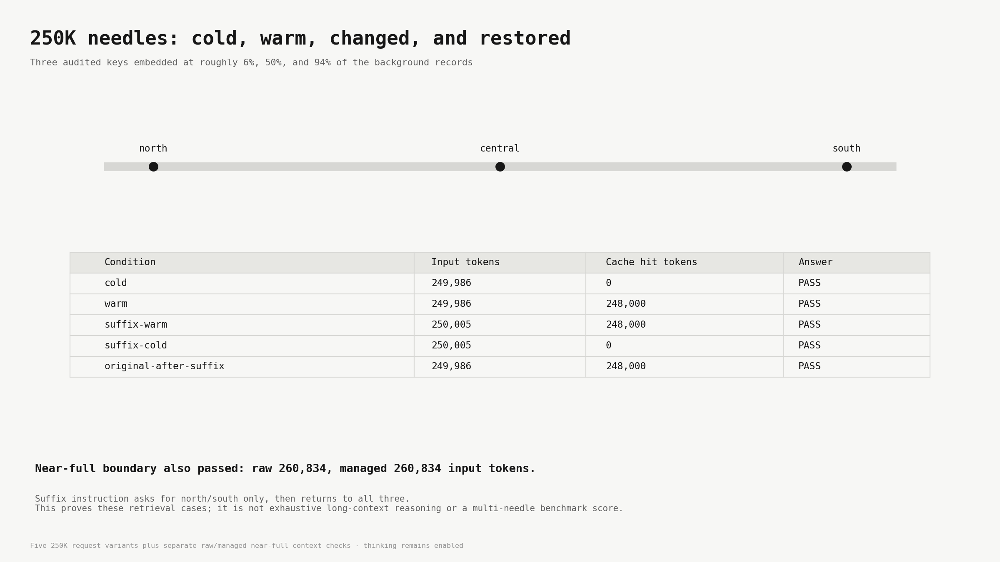
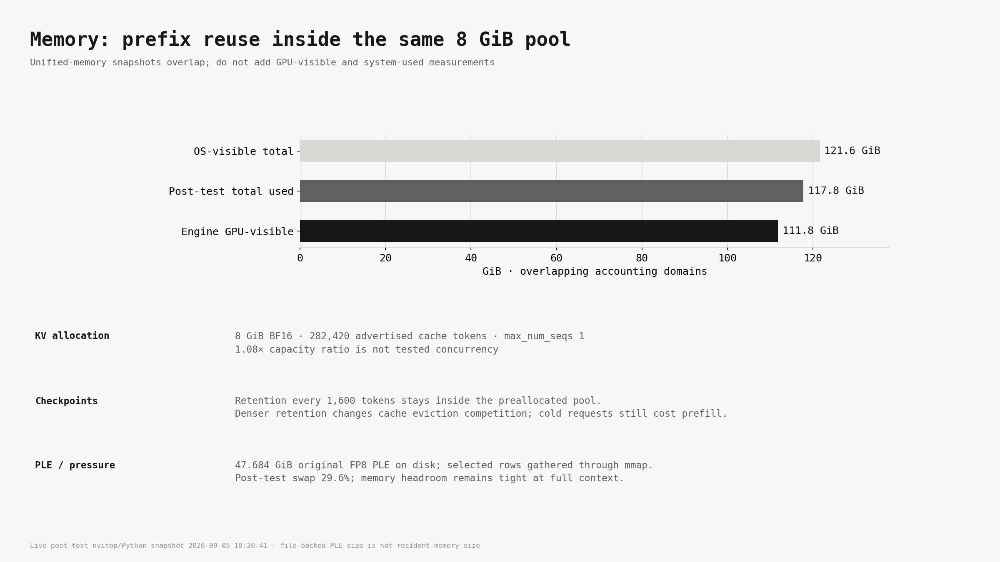
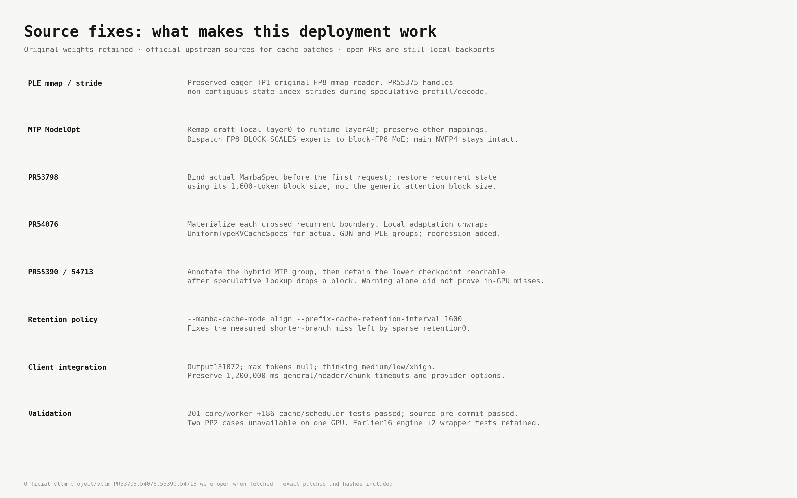
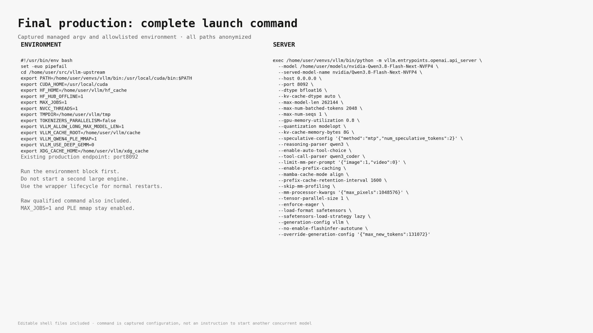
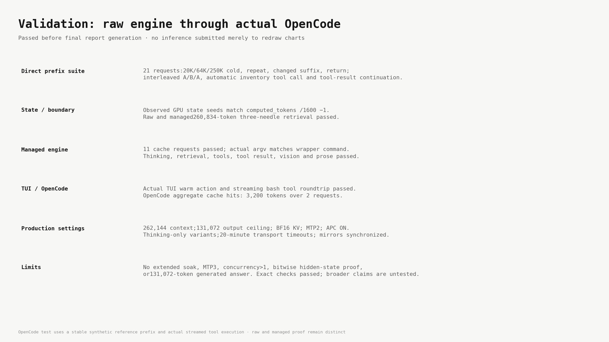
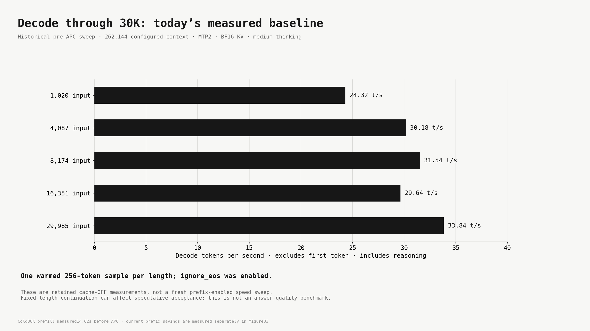

# Qwen3.8 Flash Next: final production dossier

DGX Spark · verified 2026-09-05 18:19:19 MDT.

This is the full post-prefix-cache remake. The earlier cache-OFF atlas is preserved separately as historical evidence. Production is262144 context,8GiB BF16 KV,MTP2,thinking enabled,APC enabled,align mode,retention1600.

## Current cache measurements and fixes


| Test | Input | Reused tokens | Cold prefill | Warm prefill | Speedup |
|---|---:|---:|---:|---:|---:|
| 20K | 19,984 | 17,600 | 13.224s | 1.390s | 9.5× |
| 64K | 63,989 | 60,800 | 32.412s | 1.721s | 18.8× |
| 250K | 249,986 | 248,000 | 157.903s | 1.450s | 108.9× |
| 20K managed | 19,984 | 17,600 | 13.493s | 1.398s | 9.7× |

Single sequential requests on the local API. Cold controls use independent
cache_salt namespaces, not a second engine or a cache flush. Output lengths
vary, so the comparison uses server prefill time rather than whole-response
wall time. First cold request includes first-use effects. This is a prefix
prefill improvement; it is not a decode t/s claim or a general agent benchmark.

## Repairs and provenance

All four patches were fetched from the official vllm-project/vllm repository.
They were open/unmerged when retrieved; this remains a locally patched build.

- [PR53798](https://github.com/vllm-project/vllm/pull/53798): bind actual recurrent cache specs and restore state using their block size.
- [PR54076](https://github.com/vllm-project/vllm/pull/54076): materialize each crossed recurrent checkpoint. Local adaptation unwraps UniformTypeKVCacheSpecs; regression added.
- [PR55390](https://github.com/vllm-project/vllm/pull/55390): identify the trailing hybrid MTP group. Its warning alone did not explain in-GPU zero hits.
- [PR54713](https://github.com/vllm-project/vllm/pull/54713): retain the lower checkpoint reachable after speculative lookup drops a block. Context-only adaptation preserves newer local arguments.

Production uses `--enable-prefix-caching --mamba-cache-mode align` and
`--prefix-cache-retention-interval 1600`.
The observed recurrent grid is1600 tokens; the separate QSA scratch ring is8.
Dense checkpoint retention is contained within the fixed8GiB cache pool. It
changes eviction competition, not that allocation. Eviction, earlier prompt
edits, or a changed system/tool prefix can still cause misses; full-context
capacity does not promise multiple complete cached conversations.

## Evidence and limits

201 core/worker tests passed; two PP2 platform cases were unavailable on this
single GPU. Another186 cache/scheduler tests and source pre-commit passed.
Raw qualification covers20K,64K,250K repeats, changed suffixes, return to a
shorter prompt, interleaved requests, automatic tool calls and tool results.
Managed qualification repeats the20K suite. Both paths additionally pass
260834-token retrieval and feature checks. Managed argv parity, actual TUI warm
action and actual streaming OpenCode tool execution are checked separately.

Earlier failed attempts are preserved: three patches still produced0 hits;
four patches with sparse retention0 produced hits but missed a shorter branch.
The final retained-checkpoint configuration passes those checks. Correct
answers are not bitwise hidden-state proof or an exhaustive workload test.
No extended production soak, MTP3 result, or full131072-token generated output
is claimed. The output limit shares the remaining context with the input.

vLLM0.28.1rc1.dev442+g7fbd44cbe.d20260905, source base
7fbd44cbe0a90b9c8fd3a94a0f0401ac4b1bc719 plus the documented prior PLE/MTP
fixes and these cache patches. Original model revision
fab0aecb760cec45227f6656abcaafa11abca87a.


## Full visual atlas

Ten freshly rendered figures follow the recovered FrankenGPT off-white/monospace style. The two speed baselines are explicitly historical; they have not been relabeled as new APC measurements.

### 01 Final Runtime and Model



Final live configuration · no checkpoint conversion · original NVIDIA mixed NVFP4 / FP8 / BF16 preserved

### 02 MTP2 Selection Historical


Retained measurements, freshly rendered · no MTP3 result claimed · outputs differ, request dictionaries match

### 03 Prefix Cache Cold vs Warm


Single sequential samples · raw API proof · same 8 GiB allocation · no extrapolated throughput claims

### 04 250K Needle Qualification



Five 250K request variants plus separate raw/managed near-full context checks · thinking remains enabled

### 05 Memory and Cache



Live post-test nvitop/Python snapshot 2026-09-05 18:20:41 · file-backed PLE size is not resident-memory size

### 06 Fixes and Provenance



Official vllm-project/vllm PR53798,54076,55390,54713 were open when fetched · exact patches and hashes included

### 07 Final Production Command



Editable shell files included · command is captured configuration, not an instruction to start another concurrent model

### 08 Production Validation



OpenCode test uses a stable synthetic reference prefix and actual streamed tool execution · raw and managed proof remain distinct

### 09 30K Decode Historical



Cold30K prefill measured14.62s before APC · current prefix savings are measured separately in figure03

### 10 AA Intelligence Index


Artificial Analysis authenticated API | retrieved 2026-09-06T00:01:30.869790+00:00 | Artificial Analysis model evaluation

## Complete runtime versions and earlier fixes


| Component | Version / identity |
|---|---|
| vLLM | `0.28.1rc1.dev442+g7fbd44cbe.d20260905` |
| Upstream base | `7fbd44cbe0a90b9c8fd3a94a0f0401ac4b1bc719` plus preserved local patches |
| PyTorch | `2.13.0` |
| FlashInfer | `0.6.18` |
| Transformers | `5.16.1` |
| Interpreter / platform | Python3.12 venv, Linux aarch64 |
| Driver / reported CUDA | `580.173.02` / `13.0` (nvitop snapshot) |
| Kernel | `6.17.0-1031-nvidia` |
| Target expert backend | `FLASHINFER_CUTLASS` NVFP4 |
| Draft expert backend | Generic block-FP8 MoE / Triton, blocks128×128 |

1. Preserved existing `VLLM_QWEN4_PLE_MMAP=1` implementation. The original FP8 table remains file-backed; selected CPU-gathered rows are copied to GPU for upstream dequantization. Eager execution and TP1 guards remain. It is not asynchronous prefetch or direct GPU NVMe access.
2. `vllm/models/qwen4_exp/nvidia/mtp.py`: remap ModelOpt draft-local layer0 to runtime global layer48 using the actual draft start/count. Preserve unrelated mappings, make repeat application safe, reject conflicting entries. Construct the draft with the properly remapped mixed-precision quantization config.
3. `vllm/model_executor/layers/quantization/modelopt.py`: dispatch `FP8_BLOCK_SCALES` routed experts through generic `Fp8MoEMethod` with the checkpoint block geometry. Preserve the main NVFP4 path. This makes the original mixed-precision draft load correctly; it does not convert all MTP weights to FP8.
4. `vllm/models/qwen4_exp/nvidia/ops/ple.py`: official upstream PR55375 state-index stride handling. Strided/noncontiguous prefill and decode indices must be indexed using their actual layout during speculation. Focused tests cover the affected GPU convolution path.
5. `vllm_cli.py`: preserve existing model request options, reasoning variants and unrelated models when syncing provider metadata. Merge provider options so header/chunk timeouts survive. Smoke checks reject reasoning-only or length-truncated output as success. Two regression tests passed.
6. Output/SSE integration: thinking remains enabled; default medium, supported low/xhigh variants. Model metadata output131072, request `max_tokens:null`, engine override `max_new_tokens:131072`. General/header/chunk timeouts1200000ms. This avoids the demonstrated8192-token malformed tool-write truncation and the client's smaller default ceiling; it does not establish the cause of the original damaged report.
7. Promotion harness: explicitly select the managed server's default tmux socket and remove inherited TMUX on CLI launch. Normalize numeric flag comparison (`0.80` versus `0.8`). A harness failure was resumed from the passed raw output-cap proof without repeating that expensive load.

Sixteen selected engine regression tests and source pre-commit checks passed. No checkpoint re-quantization or new full rebuild was required for the Python fixes. Keep MAX_JOBS=1, NVCC_THREADS=1, cached FlashInfer kernels, DEEP_GEMM disabled and FlashInfer autotuning disabled for this measured configuration. The missing GB10 draft MoE tuning JSON remains an optimization candidate, not a fix applied here.

The performance comparison is16.5368→26.8284 decode tokens/s (+62.2%) and2266.074→1863.142 prefill tokens/s (−17.8%), from identical47643-token requests at131072 configured context. These figures include reasoning tokens and are not measured262K decode rates.


## Model and artifact specifications


- Checkpoint: `nvidia/Qwen3.8-Flash-Next-NVFP4`
- Pinned revision: `fab0aecb760cec45227f6656abcaafa11abca87a`; 11 safetensors; original weights retained.
- Main routed experts: NVFP4 (group size16); remaining main layers BF16.
- MTP routed experts: block-scaled FP8 (128×128); other MTP layers BF16.
- PLE: FP8 per-tensor scale, 51,200,245,760 bytes, 128 × 2,500,012 ×160.
- Text:48 layers, hidden2560, vocab248320, attention heads24/KV heads2, head dimension256; 36 linear +12 sparse attention layers;512 experts,10 selected plus shared; intermediate640.
- MTP: one auxiliary layer reused for two speculative tokens.
- Vision:27 layers, hidden1152,16 heads, patch16, merge2; profile permits1 image and0 videos.
- Native local config max_position_embeddings262144. Full model config attached. NVIDIA card specifies125B main /6B activated, plus51B n-gram embeddings and4B MTP; preserve those categories rather than calling every component125B total.


## Final measured integration

```json
{
  "promotion": {
    "stage": "PASS: prefix caching promoted to262K production",
    "time": "2026-09-05 18:19:19",
    "context": 262144,
    "mtp": 2,
    "kv": "BF16 8GiB",
    "mamba_cache_mode": "align",
    "output_cap": 131072,
    "thinking": true
  },
  "opencode": {
    "exit_code": 0,
    "requests": 2,
    "completed_tool_output": true,
    "final_text": true,
    "request_parameters": [
      {
        "model": "nvidia/Qwen3.8-Flash-Next-NVFP4",
        "max_tokens": null,
        "temperature": 1,
        "top_p": 0.95,
        "presence_penalty": 0,
        "top_k": 20,
        "repetition_penalty": 1,
        "chat_template_kwargs": {
          "enable_thinking": true
        },
        "reasoning_effort": "medium",
        "tool_choice": "auto",
        "stream": true,
        "stream_options": {
          "include_usage": true
        }
      },
      {
        "model": "nvidia/Qwen3.8-Flash-Next-NVFP4",
        "max_tokens": null,
        "temperature": 1,
        "top_p": 0.95,
        "presence_penalty": 0,
        "top_k": 20,
        "repetition_penalty": 1,
        "chat_template_kwargs": {
          "enable_thinking": true
        },
        "reasoning_effort": "medium",
        "tool_choice": "auto",
        "stream": true,
        "stream_options": {
          "include_usage": true
        }
      }
    ],
    "prefix_cache_hit_tokens": 3200.0,
    "prefix_cache_query_tokens": 12611.0,
    "scope": "Actual OpenCode streaming bash roundtrip with stable synthetic reference prefix; aggregate metrics over the scoped run",
    "pass": true
  },
  "memory": {
    "time": "2026-09-05 18:20:41",
    "total_gib": 121.62497329711914,
    "used_gib": 117.7524528503418,
    "engine_gib": 111.82054138183594,
    "swap_percent": 29.625661283889123,
    "mem_available_gib": 3.8725204467773438,
    "scope": "Post-qualification snapshot; GPU and system accounting overlap"
  }
}
```

## Complete final production command

```bash
#!/usr/bin/env bash
set -euo pipefail
cd /home/user/src/vllm-upstream
export PATH=/home/user/venvs/vllm/bin:/usr/local/cuda/bin:$PATH
export CUDA_HOME=/usr/local/cuda
export HF_HOME=/home/user/vllm/hf_cache
export HF_HUB_OFFLINE=1
export MAX_JOBS=1
export NVCC_THREADS=1
export TMPDIR=/home/user/vllm/tmp
export TOKENIZERS_PARALLELISM=false
export VLLM_ALLOW_LONG_MAX_MODEL_LEN=1
export VLLM_CACHE_ROOT=/home/user/vllm/cache
export VLLM_QWEN4_PLE_MMAP=1
export VLLM_USE_DEEP_GEMM=0
export XDG_CACHE_HOME=/home/user/vllm/xdg_cache
exec /home/user/venvs/vllm/bin/python -m vllm.entrypoints.openai.api_server \
  --model /home/user/models/nvidia-Qwen3.8-Flash-Next-NVFP4 \
  --served-model-name nvidia/Qwen3.8-Flash-Next-NVFP4 \
  --host 0.0.0.0 \
  --port 8092 \
  --dtype bfloat16 \
  --kv-cache-dtype auto \
  --max-model-len 262144 \
  --max-num-batched-tokens 2048 \
  --max-num-seqs 1 \
  --gpu-memory-utilization 0.8 \
  --quantization modelopt \
  --kv-cache-memory-bytes 8G \
  --speculative-config '{"method":"mtp","num_speculative_tokens":2}' \
  --reasoning-parser qwen3 \
  --enable-auto-tool-choice \
  --tool-call-parser qwen3_coder \
  --limit-mm-per-prompt '{"image":1,"video":0}' \
  --enable-prefix-caching \
  --mamba-cache-mode align \
  --prefix-cache-retention-interval 1600 \
  --skip-mm-profiling \
  --mm-processor-kwargs '{"max_pixels":1048576}' \
  --tensor-parallel-size 1 \
  --enforce-eager \
  --load-format safetensors \
  --safetensors-load-strategy lazy \
  --generation-config vllm \
  --no-enable-flashinfer-autotune \
  --override-generation-config '{"max_new_tokens":131072}'
```

## Managed profile

```json
{
  "display_name": "NVIDIA Qwen3.8 Flash Next NVFP4 | 262K | MTP2 | BF16 KV | APC",
  "description": "NVIDIA mixed NVFP4 checkpoint on production native vLLM; original FP8 PLE rows mapped from disk, eager TP1; startup MM profiling skipped and images capped at 1,048,576 pixels.",
  "target_basename": "nvidia-Qwen3.8-Flash-Next-NVFP4",
  "target_repo": "nvidia/Qwen3.8-Flash-Next-NVFP4",
  "served_model_name": "nvidia/Qwen3.8-Flash-Next-NVFP4",
  "provider_name": "qwen38-flash-next-nvfp4-vllm-local",
  "provider_label": "NVIDIA Qwen3.8 Flash Next NVFP4 | 262K | MTP2 | BF16 KV | APC",
  "provider_display_name": "NVIDIA Qwen3.8 Flash Next NVFP4",
  "backend": "native",
  "port": 8092,
  "max_model_len": 262144,
  "max_num_batched_tokens": 2048,
  "max_num_seqs": 1,
  "gpu_memory_utilization": 0.8,
  "kv_cache_memory_bytes": "8G",
  "dtype": "bfloat16",
  "kv_cache_dtype": "auto",
  "quantization": "modelopt",
  "output_limit": 131072,
  "reasoning_budget": 4096,
  "startup_timeout": 1800,
  "trust_remote_code": false,
  "reasoning_parser": "qwen3",
  "tool_call_parser": "qwen3_coder",
  "limit_mm_per_prompt": "{\"image\":1,\"video\":0}",
  "enable_prefix_caching": true,
  "enable_auto_tool_choice": true,
  "extra_env": {
    "VLLM_QWEN4_PLE_MMAP": "1",
    "CUDA_HOME": "/usr/local/cuda",
    "MAX_JOBS": "1",
    "NVCC_THREADS": "1",
    "HF_HUB_OFFLINE": "1",
    "TOKENIZERS_PARALLELISM": "false",
    "VLLM_USE_DEEP_GEMM": "0"
  },
  "extra_args": [
    "--mamba-cache-mode",
    "align",
    "--prefix-cache-retention-interval",
    "1600",
    "--skip-mm-profiling",
    "--mm-processor-kwargs",
    "{\"max_pixels\":1048576}",
    "--tensor-parallel-size",
    "1",
    "--enforce-eager",
    "--load-format",
    "safetensors",
    "--safetensors-load-strategy",
    "lazy",
    "--generation-config",
    "vllm",
    "--no-enable-flashinfer-autotune",
    "--override-generation-config",
    "{\"max_new_tokens\":131072}"
  ],
  "reasoning": true,
  "vision": true,
  "tool_call": true,
  "opencode_enabled": true,
  "speculative_config": "{\"method\":\"mtp\",\"num_speculative_tokens\":2}"
}
```

## OpenCode provider

```json
{
  "npm": "@ai-sdk/openai-compatible",
  "name": "NVIDIA Qwen3.8 Flash Next NVFP4",
  "options": {
    "baseURL": "http://127.0.0.1:8092/v1",
    "maxRetries": 3,
    "timeout": 1200000,
    "chunkTimeout": 1200000,
    "headerTimeout": 1200000
  },
  "models": {
    "nvidia/Qwen3.8-Flash-Next-NVFP4": {
      "name": "NVIDIA Qwen3.8 Flash Next NVFP4 | 262K | MTP2 | BF16 KV | APC",
      "reasoning": true,
      "tool_call": true,
      "limit": {
        "context": 262144,
        "output": 131072
      },
      "reasoning_budget": 4096,
      "vision": true,
      "modalities": {
        "input": [
          "text",
          "image"
        ],
        "output": [
          "text"
        ]
      },
      "options": {
        "temperature": 1.0,
        "top_p": 0.95,
        "top_k": 20,
        "presence_penalty": 0,
        "repetition_penalty": 1.0,
        "reasoningEffort": "medium",
        "chat_template_kwargs": {
          "enable_thinking": true
        },
        "max_tokens": null
      },
      "variants": {
        "low": {
          "reasoningEffort": "low",
          "chat_template_kwargs": {
            "enable_thinking": true
          }
        },
        "medium": {
          "reasoningEffort": "medium",
          "chat_template_kwargs": {
            "enable_thinking": true
          }
        },
        "xhigh": {
          "reasoningEffort": "xhigh",
          "chat_template_kwargs": {
            "enable_thinking": true
          }
        },
        "high": {
          "disabled": true
        },
        "none": {
          "disabled": true
        }
      }
    }
  }
}
```

## Operating checks

```bash
curl -fsS http://127.0.0.1:8092/health
curl -fsS http://127.0.0.1:8092/v1/models
nvitop --once --no-unicode
```

## AA comparison and conclusion

Qwen3.8-Flash-Next scores45.6 on AA Intelligence Index v4.2. The chart keeps the highest score per model family across efforts and older versions, then sorts the leading models. NVIDIA reports near-parity with FP8 on nine benchmarks, with a largest decrease of0.7 points. See the pinned NVIDIA precision table in docs/NVIDIA_PRECISION.md. The setup serves262K with verified retrieval, tools and prefix reuse on one GB10.

Source: [Artificial Analysis model page](https://artificialanalysis.ai/models/qwen3-8-flash-next). API: `https://artificialanalysis.ai/api/v2/language/models/free`. Retrieved 2026-09-06T00:01:30.869790+00:00.

## Scope, provenance, and reproducibility

All performance numbers are measured single runs, not confidence intervals. Prefix tests use exact audited-key and tool-argument checks. Cold controls use new cache_salt namespaces; cached results require positive counters. Prefix caching reduces repeated prefill, not all generation latency. Changed early prompts or eviction can cause misses. Full context does not guarantee multiple resident conversations.

The official cache PRs remain unmerged backports at the saved revisions; source/base hashes and patches are included. The original PLE mmap reader and ModelOpt MTP repairs remain local modifications. The initial corrupted Solara report remains unexplained; later output-cap truncation was separately demonstrated. No source artifact is attributed to Solara without evidence.

The original NVIDIA checkpoint is pinned at [fab0aecb760cec45227f6656abcaafa11abca87a](https://huggingface.co/nvidia/Qwen3.8-Flash-Next-NVFP4/tree/fab0aecb760cec45227f6656abcaafa11abca87a). Source base is [7fbd44cbe](https://github.com/vllm-project/vllm/tree/7fbd44cbe0a90b9c8fd3a94a0f0401ac4b1bc719).

Paths are generalized generic installation/cache paths in command blocks. Private hostnames and Tailscale addresses are omitted. Source evidence copies are sanitized; original source hashes identify originals, while the package manifest hashes delivered copies.

## Credits


- [Qwen/Alibaba](https://huggingface.co/Qwen/Qwen3.8-Flash-Next): base model and architecture.
- [NVIDIA model artifact](https://huggingface.co/nvidia/Qwen3.8-Flash-Next-NVFP4/tree/fab0aecb760cec45227f6656abcaafa11abca87a): original mixed-precision weights.
- [NVIDIA Model Optimizer](https://github.com/NVIDIA/Model-Optimizer): quantization tooling.
- [vLLM](https://github.com/vllm-project/vllm/tree/7fbd44cbe0a90b9c8fd3a94a0f0401ac4b1bc719): engine and pinned source base.
- [FlashInfer](https://github.com/flashinfer-ai/flashinfer), [PyTorch](https://github.com/pytorch/pytorch), [Transformers](https://github.com/huggingface/transformers): runtime components.
- [Artificial Analysis](https://artificialanalysis.ai/models/qwen3-8-flash-next): Intelligence Index v4.2 data, retrieved 2026-09-06 UTC (September5 MDT).

## Upstream patch authors

| PR | Author | Change | Status when retrieved |
|---|---|---|---|
| [#53798](https://github.com/vllm-project/vllm/pull/53798) | [ptorsten](https://github.com/ptorsten) | [Bugfix] Seed align-mode Mamba state_idx in Mamba blocks | open, local backport |
| [#54076](https://github.com/vllm-project/vllm/pull/54076) | [wickist](https://github.com/wickist) | [Bugfix][V1] Use the Mamba cache group's block size for align-mode chunk splitting | open, local backport |
| [#55390](https://github.com/vllm-project/vllm/pull/55390) | [Navjot10](https://github.com/Navjot10) | [Bugfix] Annotate MTP draft KV cache groups positionally on the hybrid grouping path | open, local backport |
| [#54713](https://github.com/vllm-project/vllm/pull/54713) | [tobymao](https://github.com/tobymao) | [BugFix] Mamba sparse retention keeps a state below each boundary under EAGLE/MTP | open, local backport |
| [#55375](https://github.com/vllm-project/vllm/pull/55375) | [peakcrosser7](https://github.com/peakcrosser7) | [Bugfix][Qwen4Exp] fix state index strides in fused PLE conv | merged |

Exact PR head revisions are in `provenance/upstream-credits.json`. The complete patch includes local context adaptations, UniformTypeKVCacheSpecs unwrapping, tests, the opt-in state-index audit, the existing PLE mmap reader, ModelOpt MTP layer remapping and block-FP8 expert dispatch. Apply the complete patch once; do not stack the individual PRs on top.

Local adaptations are documented separately from upstream contributions.

The banner depicts an illustrative compact computer. It is not a product photograph. Charts were generated with Matplotlib from retained measurements. The earlier charts are preserved as historical results, with anonymous paths for publication.

[Community single-Spark experiments](https://github.com/tonyd2wild/Qwen3.8-Flash-Next-NVFP4-DGX-Spark) informed questions during research; no community implementation is included. The deployed cache fixes come from the official vLLM repository.
